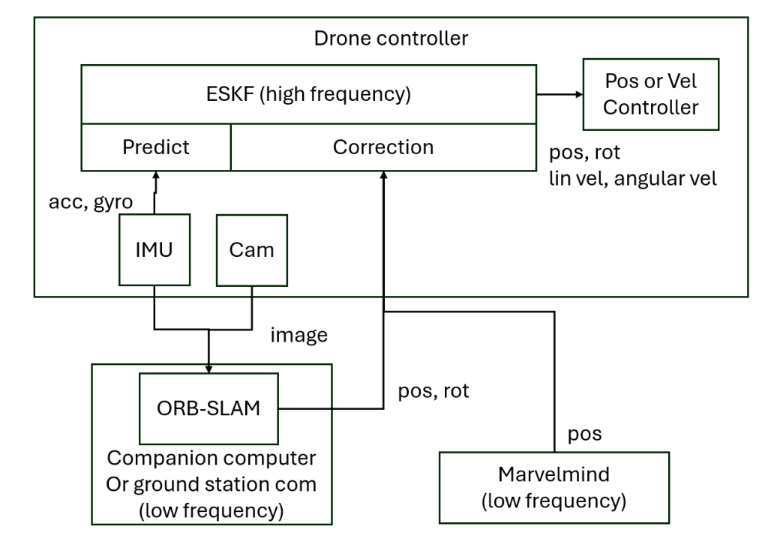

# Indoor Localization and Navigation of an Autonomous Drone

A robust multi-sensor fusion system designed for 6-DOF UAV state estimation in GPS-denied indoor environments.

## Overview
This project tackles the challenges of indoor drone navigation, such as signal multi-path effects and dynamic disturbances, by fusing high-frequency inertial data with visual and acoustic positioning systems. The core estimation framework is built upon an Error-State Kalman Filter (ESKF).

## System Architecture

The system is designed with a decentralized fusion strategy:

* **High-Frequency Prediction:** The **IMU** provides linear acceleration and angular velocity (`acc, gyro`) to the ESKF's **Predict** block.
* **Low-Frequency Correction:**
    * **Visual-Inertial Odometry:** **ORB-SLAM** (running on a companion computer/ground station) processes camera images to provide local `pos, rot` updates.
    * **Global Reference:** **Marvelmind** provides absolute 3D `pos` via ultrasonic trilateration to eliminate long-term drift.
* **Control Output:** The **ESKF** outputs a refined state estimate (`pos, rot, lin vel, angular vel`) to the **Position/Velocity Controller** for stable flight.

## Key Features
* State Estimation: Error-State Kalman Filter (ESKF) for 6-DOF tracking.
* Visual-Inertial Odometry: ORB-SLAM3 integration for high-accuracy local pose estimation and multi-map handling (Atlas).
* Global Reference: Marvelmind acoustic positioning system to eliminate long-term drift.
* Simulation Environment: Distributed Software-in-the-Loop (SITL) setup using MuJoCo and ROS2.

## Technologies Used
* ROS2 (Humble/Foxy)
* MuJoCo Physics Engine
* ORB-SLAM3
* Marvelmind Indoor Navigation System
* Python / C++

## References & Resources
* ORB_SLAM3 Repository: https://github.com/UZ-SLAMLab/ORB_SLAM3
* ROS2 ORB_SLAM3 Wrapper: https://github.com/Mechazo11/ros2_orb_slam3
* Project Video: https://youtu.be/iVY8zylndzc
* Full Report: https://drive.google.com/file/d/1Fa0ryxui53RRlmRHe7nQAHdmT3PfBMT_/view?usp=sharing

## Authors
* Nguyen Viet Khanh
* Khalid Ouchaouir
* Program: Master 2 Smart Aerospace and Autonomous Systems (SAAS)
